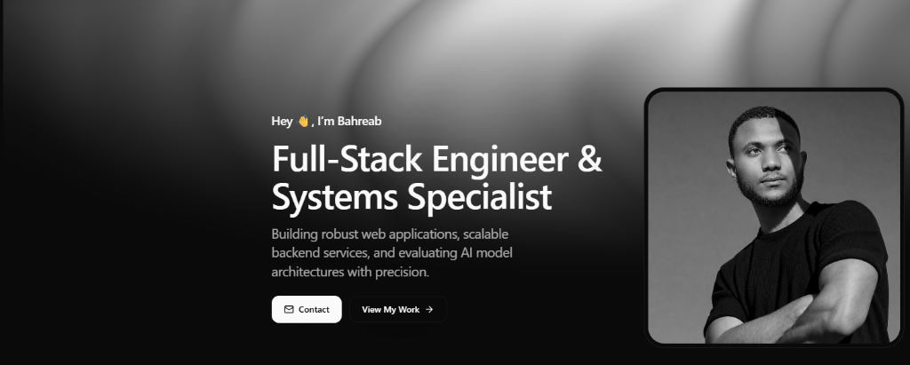

<div align="center">

  <!-- HERO BANNER -->
  

  <br/><br/>

  <!-- TYPING SVG ANIMATION -->
  <a href="https://github.com/Jolly-Junior-main">
    
  </a>

  <p align="center">
    <strong>Full-Stack Engineer & Systems Specialist • Web, Mobile, Cloud & AI Architectures 📍 Addis Ababa, Ethiopia</strong>
  </p>

  <!-- SOCIAL / BADGE BAR -->
  <p align="center">
    <a href="https://github.com/Jolly-Junior-main?tab=followers"></a>
    <a href="https://github.com/Jolly-Junior-main"></a>
    <a href="mailto:bahreabfeleke@gmail.com"></a>
    <a href="mailto:service.bahreabfeleke@gmail.com"></a>
    <a href="https://github.com/Jolly-Junior-main"></a>
  </p>

</div>

---

### 💫 About Me

```javascript
const bahreab = {
    name: "Bahreab Feleke",
    handle: "Jolly-Junior-main",
    role: "Full-Stack Engineer & Systems Specialist",
    location: "Addis Ababa, Ethiopia",
    phone: "+251 919 477 040",
    coreExpertise: [
        "Robust Web Applications & Next-Gen Frontends",
        "Scalable Backend Services & API Microservices",
        "AI Model Architecture Evaluation & Integration",
        "Systems Engineering (Linux, Windows Server, Cisco)",
        "Mobile App Engineering (Flutter & React Native)",
        "Modern UI/UX Design & Prototyping (Figma & Adobe XD)"
    ],
    techStack: ["TypeScript", "React", "Next.js", "Node.js", "Python", "PHP", "Laravel", "Flutter", "Firebase", "PostgreSQL"],
    contact: {
        personal: "bahreabfeleke@gmail.com",
        services: "service.bahreabfeleke@gmail.com"
    },
    quote: "Building robust web applications, scalable backend services, and evaluating AI model architectures with precision."
};
```

- 🚀 **Full-Stack & Systems:** Building robust web apps, scalable backend services, and evaluating AI model architectures.
- 📱 **Mobile Development:** Flutter, React Native, Firebase, iOS & Android App Engineering.
- 🎨 **UI/UX & Design:** Figma, Adobe XD, Photoshop, Illustrator, Prototyping & Design Systems.
- 🛠️ **Systems & Infrastructure:** Linux, Windows Server, macOS, Cisco, Docker, Cloud & DevOps.
- 💼 **Available For:** Full-time Software Engineering roles, High-impact Freelance projects & Tech Consulting.
- 📬 **Get in Touch:** Reach out directly at [bahreabfeleke@gmail.com](mailto:bahreabfeleke@gmail.com) or for service inquiries at [service.bahreabfeleke@gmail.com](mailto:service.bahreabfeleke@gmail.com).

---

### 🛠️ Tech Stack & Toolkit

<div align="center">

#### 💻 Web & Frontend
<p align="center">
  
  
  
  
  
  
  
</p>

#### 📱 Mobile Engineering
<p align="center">
  
  
  
  
  
</p>

#### ⚙️ Backend, Frameworks & APIs
<p align="center">
  
  
  
  
  
  
</p>

#### 🎨 Design & Prototyping
<p align="center">
  
  
  
  
</p>

#### 🔧 Systems & Infrastructure
<p align="center">
  
  
  
  
  
  
</p>

</div>

---

### 📊 GitHub Real-Time Analytics

<div align="center">
  <table border="0">
    <tr>
      <td>
        
      </td>
      <td>
        
      </td>
    </tr>
  </table>

  <br/>

  <!-- STREAK STATS -->
  

  <br/><br/>

  <!-- TROPHIES -->
  <a href="https://github.com/ryo-ma/github-profile-trophy">
    
  </a>
</div>

---

### 🚀 Featured Repositories & Projects

| Project | Tech Stack | Highlights | Repository |
| :--- | :--- | :--- | :---: |
| **🏢 EPMS** | `TypeScript` `Next.js` `Tailwind` `Firebase` | Full-stack Enterprise Property Management System with RBAC, real-time revenue analytics, digital receipt verification, and automated SMS engine. | [View Repo ↗](https://github.com/Jolly-Junior-main/EPMS) |
| **💇 Kaldas Salon Pro** | `TypeScript` `React` `Tailwind CSS` | Advanced Beauty Salon & Spa Management Dashboard with service scheduling, client tracker, and inventory control. | [View Repo ↗](https://github.com/Jolly-Junior-main/Kaldas-Salon-Pro-Final) |
| **📱 Kinash Marketplace** | `React Native` `Expo` `Tailwind` | Next-gen Ethiopian digital services & mobile recharge marketplace application with clean UX. | [Explore ↗](https://github.com/Jolly-Junior-main) |

---

### 🤝 Connect With Me

<div align="center">
  <a href="mailto:bahreabfeleke@gmail.com"></a>
  <a href="mailto:service.bahreabfeleke@gmail.com"></a>
  <a href="tel:+251919477040"></a>
  <a href="https://github.com/Jolly-Junior-main"></a>
  <a href="https://linkedin.com"></a>
  <a href="https://t.me"></a>
</div>

<br/>

<div align="center">
  <sub>⭐️ Built with care by <b>Bahreab Feleke</b> (<code>Jolly-Junior-main</code>) ⭐️</sub>
</div>
